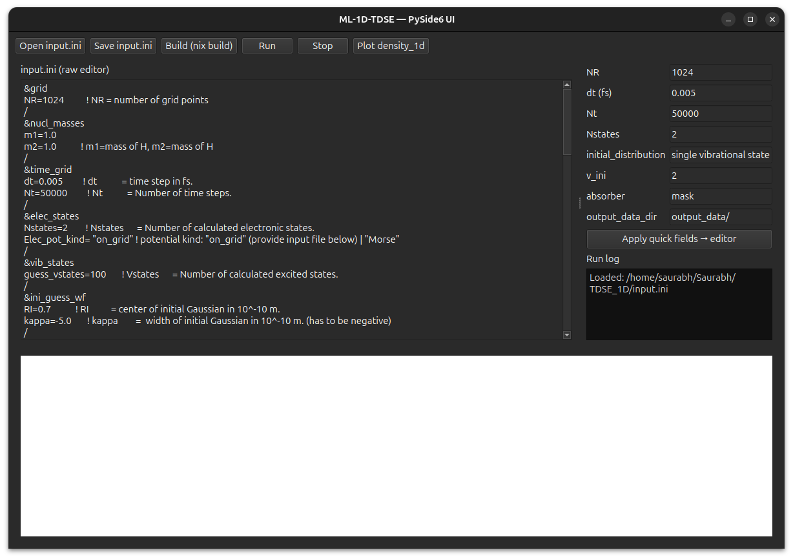

# GUI Quick Guide — Multi-level 1D TDSE

This guide explains how to use the PySide6-based graphical interface for the Multi-level 1D TDSE solver.

## 1. Installation

Install Python dependencies:

```sh
python3 -m pip install -r tools/requirements.txt
```

## 2. Launch the GUI

Run:

```sh
python3 tools/pyqt_gui.py
``` 
You should see something like this



## 3. Main Features
* Open input.ini: Load an existing input file for editing.
* Edit input.ini: Use the text editor or the "Quick fields" panel for common parameters.
* Save input.ini: Save your changes.
* Build (nix build): Compile the Fortran code using Nix.
* Run: Start a simulation with the current input file.
* Stop: Terminate a running simulation.
* Run log: View output and error messages from build/run.
* Plot density_1d: Visualize the output file density_1d.out

## 4. Typical Workflow
* Open or edit your input.ini file.
* Adjust parameters in the "Quick fields" panel and apply changes.
* Save the input file.
* Click "Build (nix build)" if you haven't built the project yet.
* Click "Run" to start the simulation.
* Monitor progress in the "Run log".
* When the simulation finishes, click "Plot density_1d" to view results.

## 5. Notes
* The GUI is a helper tool for editing, running, and visualizing. For advanced  input editing, use a text editor.
* Output files are expected in the directory specified by output_data_dir in your input file.
* For troubleshooting, check the "Run log" for error messages.