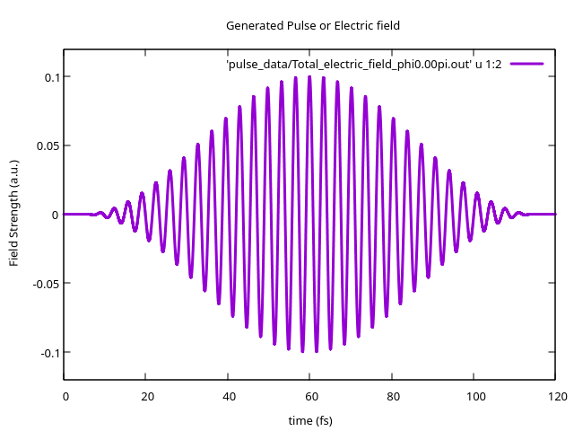

# Test Results (for sanity check)

After a sucessful installation, you may run a test calcuation using the provided `input.ini` file.

```
$ ./results/bin/ML-TDSE input.ini                                  # Run with test input parameters (input.ini)
```
After the calculation is complete, the output data will be stored in `output_data` directory. Here are some plots of the generated data after the test.

**NOTE:** If you encounter any anomolous results or behaviour while execution/run, we suggest to remove the entire output directory (`rm -r output_data/`) and start a new run again.

## Potential Energy Surfaces Check
First, let's see what were the input potetial surfaces. We plot the data in `output_data/H2+_BO.dat_read.out`. There are three columns: R(a.u.), Ground state g0(a.u.), First Excited state g1(a.u). 


## Pulse plots

The pulse data is stored in `output_data/pulse_data` directory. To get the total electric field pulse, we may plot the data in `Total_electric_field_phi0.00pi.out`. Only two columns: time (fs) and field strength (a.u.)
The test pulse should look like as follows.



## Vibrational state calculations

The best way to check if vibrational calculations are working properly is to compare the `Start of energy calculation` section of the output log with the provided [`test_run.log`](log/test_run.log). A few lines at the start of it should look like as follows.

```
 Start of energy calculation...

 output_data/nuclear_wavepacket_data/BO_Electronic-state-g0_vibstates.out  F
 output_data/nuclear_wavepacket_data/BO_Electronic-state-g1_vibstates.out  F
 Dp =  -13.624215477511600      eV
 Surface           0 Vibrational state           0  -16.256173627552833      eV
 Resonance freq for dissociation   2.6319581500412332      eV
 Resonance freq for dissociation   471.07130704220685      nm
 Surface           0 Vibrational state           1  -15.984037788105853      eV
 Resonance freq for dissociation   2.3598223105942546      eV
 Resonance freq for dissociation   525.39547586025401      nm
 freq for the transition from           0 to           1 :   4555.9598777575775      nm E=  0.27213583944697861      eV
 Surface           0 Vibrational state           2  -15.728359512801770      eV
 Resonance freq for dissociation   2.1041440352901710      eV
 Resonance freq for dissociation   589.23721238947076      nm
 freq for the transition from           0 to           2 :   2349.0087346471778      nm E=  0.52781411475106199      eV
 freq for the transition from           1 to           2 :   4849.2190599523792      nm E=  0.25567827530408332      eV
```
Further output files from these calcuations such vibartional eigen energies and eigenstates are stored in  `output_data/nuclear_wavepacket_data`


## Time propagation calculations

In this case the outfiles are stored in `output_data/time_prop`. Out of the many generated data files, it would be sufficient to check norm of the bound wavefunction over time at the start. We can plot the data from `norm_1d.out`. Only two columns: time(fs), norm $`\langle \psi | \psi \rangle`$ (arbitrary units).


